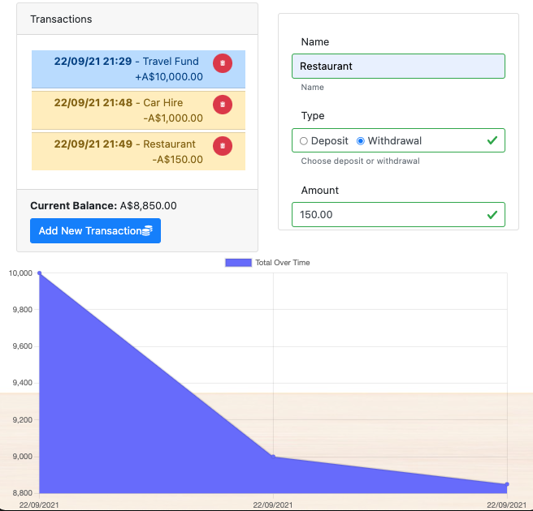

# PWA Budget Tracker    [](https://opensource.org/licenses/MIT)

# Table of Contents
- [Project Description](#project-description)
- [Installation Instructions](#installation-instructions)
- [Configuration Variables](#configuration-variables)
- [User Story](#user-story)
- [Screenshot](#screenshot)
- [How To Contribute](#how-to-contribute)
- [Technology](#technology)
- [Presentation](#presentation)
- [Questions](#questions)
- [License](#license)


# Project Description
This [web application](https://budget-tracker-jps.herokuapp.com/) allows the user to track their deposits and withdrawals and keep track of their current balance.

If the server becomes offline (poor mobile service or network loss) the transactions will be saved and queued for when the server is available or when the user returns to the webpage in the future.

# Installation Instructions

1.  Install [node.js](http://nodejs.org)
2.  Using the installed Node Package Manager `npm`, execute `npm install`  in the `frontend` directory, and again in the `backend` directory.
3.  In the `frontend` directory, execute `npm run build.prod`, to build the webpacks for the backend `public/js` directory.
4.  In the `backend` directory, execute `npm run build`, to build the `.js` files from the Typescript, which are compiled to the `dist` directory.
5.  Configure the `.env` file with the specifics of your database, configuration files, and other parameters (message queue persistence, room timeouts):

# Configuration Variables

`API_SERVER_URL` - URL of the server completing the API calls (default `blank`)

`DB_URL` - address and access to the Mongo server machine 

`DEBUG` - activate debug output (sub-options are space separated names (e.g. `server socket db api route message-queue`)

`MODE` - `Production`

`DB_COLLECTION_TRANSACTIONS` - `transactions` the object collection in the MongoDB

`VIEW_RELATIVE_PATH` - location of the handlebars files in production, should be set to `/../../`

# User Story

```
AS AN avid traveller
I WANT to be able to track my withdrawals and deposits with or without a data/internet connection
SO THAT my account balance is accurate when I am traveling
```

# Screenshot

!

## How to contribute

Please access the [Questions](#questions) section to send me an email, or access the repository link if you wish to help contribute to this project.


# Technology

1. [Node.js](http://nodejs.org)
2. NPM
3. [Moment](https://npmjs.com/package/moment)
4. [Bootstrap](https://getbootstrap.com/)
5. [Webpack](https://www.typescriptlang.org/)
6. [Babel](https://babeljs.io/)
7. [MongoDB](https://www.mongodb.com/)
8. [Mongoose](https://mongoosejs.com/docs/)
9. [DotENV](https://www.npmjs.com/package/dotenv)
10. [Git-Crypt](https://github.com/AGWA/git-crypt)
11. [Express](https://www.npmjs.com/package/express)
12. [Typescript](https://www.typescriptlang.org/)
13. [ts-node](https://github.com/TypeStrong/ts-node)
14. [tsc-watch](https://www.npmjs.com/package/tsc-watch)
15. [ts-loader](https://github.com/TypeStrong/ts-loader)
16. [Chart.js](https://www.chartjs.org/)
17. [Bootstrap 4 Round Buttons](https://www.geeksforgeeks.org/how-to-get-circular-buttons-in-bootstrap-4/)
18. [IndexedDB](https://developer.mozilla.org/en-US/docs/Web/API/IndexedDB_API/Using_IndexedDB)


# Questions

>  **Direct your questions about this project to:**
>
>  *GitHub:* [Github Project Link](https://github.com/jsharples777/pwa-budget-tracker)
>
>  *Email:* [jamie.sharples@gmail.com](mailto:jamie.sharples@gmail.com)

# License

### [MIT License](https://opensource.org/licenses/MIT)
A short and simple permissive license with conditions only requiring preservation of copyright and license notices. Licensed works, modifications, and larger works may be distributed under different terms and without source code.
